## Servus 👋

> "Servus" — the Alpine way to say hello, mostly used in Bavaria and Austria.

  
  

<table style="width: 100%">
  <tr>
    <td style="vertical-align: top; width: 50%;">
      
<code>$ ~/about-me.md</code>

      <ul>
        <li> 🔭 I do research at <a href="https://th-deg.de/tc-freyung-en">Technology Campus Freyung</a> </li>
         
        <li> 🧗 Outside of work:
          <ul>
            <li>⛑️ Active duty with <a href="https://www.bergwacht-bayern.de">Bavarian Mountain Rescue</a>
            <li>🚑 Volunteer at <a href="https://www.brk.de/">Bavarian Red Cross</a>
          </ul>
        </li>
         
        <li> 📫 How to reach me: <a href="mailto:suhrmann@posteo.de">suhrmann@posteo.de</a> </li>
      </ul>
    </td>
    <td style="width: 50%; vertical-align: top;">
      
<code>$ ~/portfolio.md</code>

      <ul>
        <li> <a href="https://github.com/suhrmann/Anno-1800-Calculator">Anno-1800-Calculator </a>  
        Calculator for web and desktop using Electron - sadly abandoned by now due to lack of time :(</li>
        <li> <a href="">Watchdog2MQTT</a>  
        Transmit new files in a directory via MQTT.</li>
        <li> <a href="https://github.com/suhrmann/Karlorona">Karlorona</a>  
        Android/iOS app in Flutter for hackathon <a href="https://wirvsvirus.org/hackaton/">#WirvsVirus</a> (unpublished) </li>
      </ul>
    </td>
  </tr>
</table>
